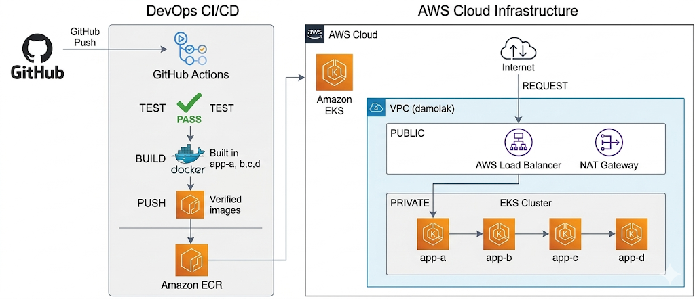
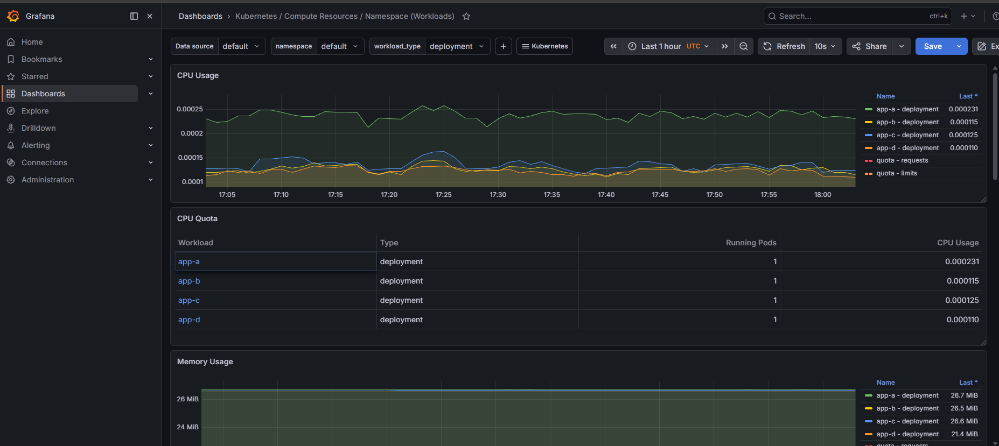

# Production-Ready Microservices Deployment on AWS EKS

## Overview

**Explain:**

* ***microservices application***
* ***deployed on EKS***
* ***Terraform-managed infrastructure***
* ***CI/CD with GitHub Actions***

## Prerequisites

Before running this project, ensure the following tools are installed:

- Terraform
- AWS CLI
- kubectl
- Docker
- Git

AWS credentials must also be configured locally.

---

## Clone Repository

```bash
git clone <repository-url>
cd damolak
```

---

## Configure AWS Credentials

```bash
aws configure
```

Provide:

- AWS Access Key
- AWS Secret Key
- Region: us-west-2 or region of your choice

---

## Provision Infrastructure

Initialize Terraform:

```bash
terraform init
```

Review execution plan:

```bash
terraform plan
```

Create infrastructure:

```bash
terraform apply -auto-approve
```

This provisions:

- VPC
- Public & Private Subnets
- NAT Gateway
- Internet Gateway
- EKS Cluster
- ECR Repositories

---

## Configure kubectl

After infrastructure creation:

```bash
aws eks update-kubeconfig \
  --region us-west-2 \
  --name damolak-eks
```

Verify cluster connectivity:

```bash
kubectl get nodes
```

---

## Deploy Applications

Apply Kubernetes manifests:

But this is handled already by your CI/CD pipeline

```bash
kubectl apply -f application/app-a/app-a.yaml
kubectl apply -f application/app-b/app-b.yaml
kubectl apply -f application/app-c/app-c.yaml
kubectl apply -f application/app-d/app-d.yaml
```

Verify deployments:

```bash
kubectl get pods
kubectl get svc
```

---

## Access Application

Retrieve the external LoadBalancer URL:

```bash
kubectl get svc app-a
```

Open the EXTERNAL-IP / LoadBalancer DNS in a browser.

Expected response:

```text
App A here -> App B here -> App C here -> App D here -> I am the final service
```

---

## CI/CD Pipeline

The GitHub Actions pipeline automatically performs:

1. Docker image build
2. Basic application testing
3. Push images to Amazon ECR
4. Deploy updated images to Amazon EKS

Pipeline triggers automatically on push to the `main` branch.

---

## Destroy Infrastructure

To remove all infrastructure:

```bash
terraform destroy -auto-approve
```

## Architecture & Design Thinking

The infrastructure was designed with a production-oriented mindset focused on security, scalability, automation, and separation of responsibilities.



#### 1. Why Amazon EKS Was Used

**The application was deployed on Amazon Elastic Kubernetes Service because Kubernetes provides:**

* ***Container orchestration***
* ***Automated deployment management***
* ***Scalability***
* ***Self-healing capabilities***
* ***Service discovery between microservices***
* ***Rolling updates with minimal downtime***
* ***Using EKS also removes the operational burden of managing the Kubernetes control plane manually.***

#### 2. Why the Architecture Uses Public and Private Subnets
**The VPC architecture was intentionally separated into:**

2 Public Subnets and 2 Private Subnets across multiple Availability Zones (us-west-2a and us-west-2b) for high availability and fault tolerance.

This follows standard production cloud networking practices.

#### 3. Purpose of the Public Subnets

**The public subnets host resources that require internet exposure.**

**These include:**
* ***AWS Load Balancer***
* ***NAT Gateway***

Why the Load Balancer is Public
The Load Balancer receives external traffic from users on the internet and routes requests into the Kubernetes cluster.
Without a public Load Balancer:
external users would not be able to access the application services inside Kubernetes would remain internal-only

This provides controlled entry into the environment.

Why the NAT Gateway is Public
The Kubernetes worker nodes run inside private subnets and do not have direct public IP addresses.
However, the nodes still need outbound internet access for tasks such as:

* ***Pulling Docker images from Amazon ECR***
* ***Downloading packages and updates***
* ***Communicating with AWS APIs***
* ***Helm chart downloads***
* ***Monitoring integrations***

The NAT Gateway enables secure outbound internet communication while keeping the worker nodes private. This is a common security best practice.

#### 4. Why the EKS Worker Nodes Are in Private Subnets

The Kubernetes workloads (app-a, app-b, app-c, and app-d) were deployed inside private subnets to reduce exposure to the public internet.

**Benefits include:**
* ***Improved security posture***
* ***Reduced attack surface***
* ***No direct SSH/public access to containers***
* ***Internal service-to-service communication remains private***
* ***Better alignment with production security practices***


Only the Load Balancer is internet-facing.
The application containers themselves are isolated inside private networking.

#### This architecture ensures:

external traffic enters only through controlled entry points

internal services remain protected

#### 5. Why Multiple Availability Zones Were Used

**The infrastructure spans:**

***us-west-2a***
***us-west-2b***

**This was done to improve:**

* ***High availability***
* ***Fault tolerance***
* ***Resilience***

**If one Availability Zone becomes unavailable, workloads can continue operating in the second zone.**
**This is a common production-grade Kubernetes deployment strategy.**

#### 6. Why Amazon ECR Was Used

Docker images are stored in Amazon Elastic Container Registry because it integrates directly with AWS and EKS.

**Benefits include:**
* ***Secure image storage***
* ***Simplified authentication with AWS***
* ***Scalable container registry***
* ***Faster deployment integration with Kubernetes***

**Each microservice has its own repository:**

**app-a**
**app-b**
**app-c**
**app-d**

***This improves image isolation and version management.***

#### 7. CI/CD Design Decisions

**The CI/CD pipeline was implemented using GitHub Actions.**

***The pipeline performs:***

```
Source code checkout
        |
AWS authentication
        |
Docker image build
        |
Basic application testing
        |
Push images to ECR
        |
Kubernetes deployment updates
        |
Monitoring stack deployment
        |
Rollout verification
```

Why Testing Happens Before Push
The pipeline validates the application before images are pushed to ECR.

**This prevents:**

* ***broken images from entering the registry***
* ***failed deployments into Kubernetes***
* ***This improves deployment reliability.***

#### 8. Why Monitoring Was Added

**Monitoring was implemented using:**
1. Prometheus
2. Grafana

**The monitoring stack was deployed automatically through Helm during CI/CD execution.**

**Purpose of Prometheus**

**Prometheus collects:**
* ***Kubernetes metrics***
* ***Node metrics***
* ***Pod resource usage***
* ***Cluster health information***

**Purpose of Grafana**

**Grafana visualizes metrics through dashboards for:**
* ***CPU usage***
* ***Memory usage***
* ***Pod health***
* ***Cluster performance***
* ***Infrastructure monitoring***
* ***This provides observability into the Kubernetes environment.***

#### 9. Why Infrastructure as Code Was Used

**Infrastructure provisioning was implemented with Terraform.**
**Benefits include:**
* ***Repeatable deployments***
* ***Version-controlled infrastructure***
* ***Modular reusable components***
* ***Easier environment recreation***
* ***Reduced manual configuration***


**The infrastructure was separated into reusable modules:**

```
.
├── application/             # Source code for microservices (app-a, b, c, d)
├── main.tf                  # Main entry point for Terraform
├── terraform.tf             # Terraform providers and version configuration
├── modules/                 # Reusable infrastructure components
│   ├── vpc/                 # VPC networking
│   ├── subnet/              # Public and Private subnet definitions (IGW, NAT Gateway, Route Tables)
│   ├── security/            # Security Groups and IAM roles
│   ├── ecr/                 # Elastic Container Registry for Docker images
│   ├── eks/                 # Elastic Kubernetes Service cluster config
│   └── ec2/                 # Bastion hosts or additional compute resources
└── README.md                # Project documentation
```

**This improves maintainability and scalability of the codebase.**

### AWS Services Used

* ***EKS***
* ***ECR***
* ***EC2***
* ***VPC***
* ***Subnets***
* ***NAT Gateway***
* ***Internet Gateway***
* ***LoadBalancer***

## Kubernetes Deployment

* ***Deployments***
* ***Services***
* ***Internal communication***

## Monitoring & Observability



### Monitoring & Observability

This project includes a fully automated observability stack deployed into the Kubernetes cluster using Prometheus and Grafana.

The monitoring stack is deployed automatically through the CI/CD pipeline using Helm during every deployment workflow execution.

## Observability Components

The following components are deployed into the monitoring namespace:

* ***Prometheus***
* ***Grafana***
* ***Alertmanager***
* ***kube-state-metrics***
* ***Node Exporter***

## These components provide:

* ***Kubernetes cluster monitoring***
* ***Node-level metrics***
* ***Pod and workload visibility***
* ***CPU and memory utilization metrics***
* ***Application health monitoring***
* ***Infrastructure observability***
* ***CI/CD Monitoring Automation***

#### Monitoring deployment is fully integrated into the GitHub Actions CI/CD pipeline.

**During every push to the main branch, the pipeline automatically:**

* ***Configures access to the EKS cluster***
* ***Installs Helm***
* ***Adds the Prometheus Helm repository***
* ***Deploys the kube-prometheus-stack***
* ***Exposes Grafana through an AWS LoadBalancer service***


